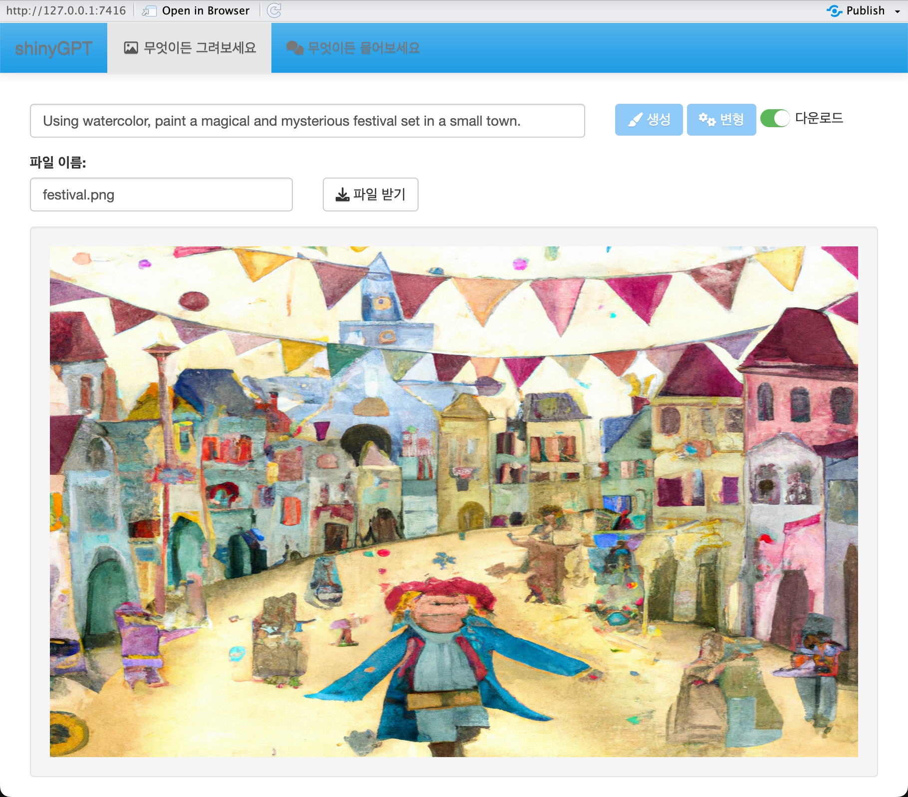
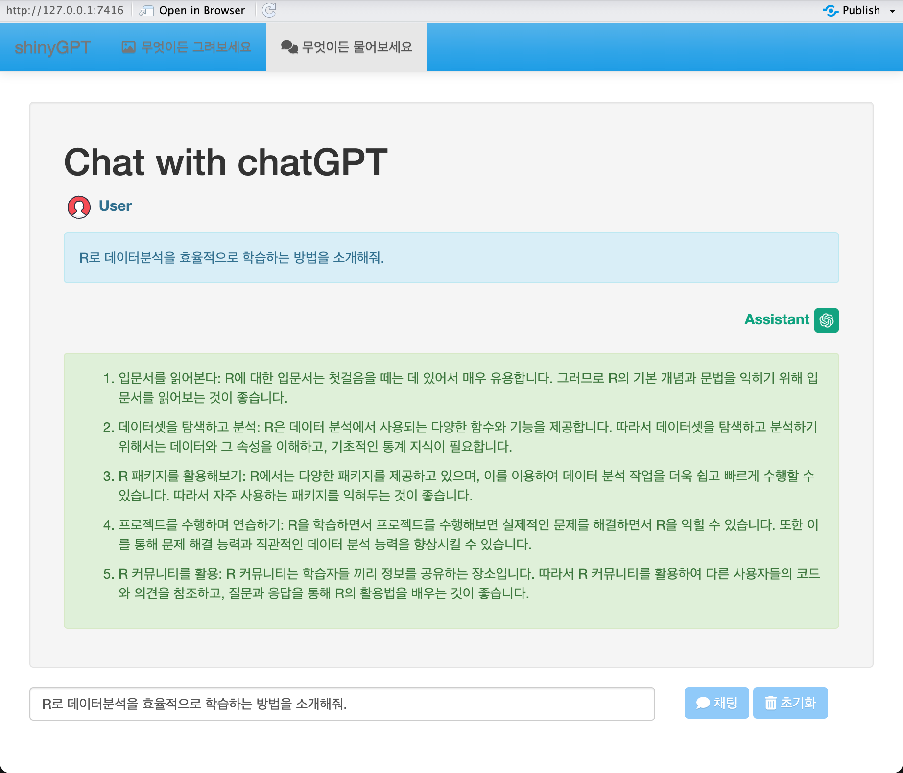

```{r, include = FALSE}
knitr::opts_chunk$set(
  collapse = TRUE,
  comment = "#>"
)
```

## shinyGPT에 대하여

`shinyGPT(Shiny chatGPT Application)`는 `OpenAI API`를 이용해서 chatGPT의 기능과 `Dall-E 2` 기반으로 이미지를 생성하고 변형하는 작업을 Shiny UI/UX 기반에서 수행할 수 있는 웹 애플리케이션을 수행하는 R 패키지입니다.

이 애플리케이션은 `bitGPT` 패키지의 응용 사례를 위해서 개발되었습니다.

## shinyGPT 기능

현재 구현된 shinyGPT의 기능을 다음과 같습니다.

* 무엇이든 그려보세요
  - 이미지 생성 with Dall-E 2
  - 이미지 변형 with Dall-E 2
  - 이미지 저장 with Dall-E 2
* 무엇이든 물어보세요 
  - 채팅 with chatGPT


## 설치

### bitGPT 패키지 설치

`shinyGPT` 패키지를 설치하기 위해서는  `bitGPT` 패키지를 설치해야 합니다.

github 리파지토리로부터 다음의 명령어로 패키지를 설치합니다.:

```{r, eval=FALSE}
devtools::install_github("bit2r/bitGPT")
```


### shinyGPT 패키지 설치

github 리파지토리로부터 다음의 명령어로 패키지를 설치합니다.:

```{r, eval=FALSE}
devtools::install_github("choonghyunryu/shinyGPT")
```

## 준비사항

`bitGPT` 패키지와 `shinyGPT` 패키지를 사용하기 위해서는 OpenAI API key와 네이버 파파고 번역 API key가 필요합니다.

두 가지 모두 준비되었다면 다음과 같이 key를 등록합니다. API key는 개인정보이기 때문에 공개해서는 안됩니다. 
그래서 아래의 예제에서는 "XXXXXXXXXXX"로 기술했지만, 실제 사용자의 key를 입력해야 합니다.

```{r, eval=FALSE}
library("bitGPT")

# 실제 사용자가 할당받은 openai API key를 사용합니다.
regist_openai_key("XXXXXXXXXXX")

# 실제 사용자가 할당받은 Naver API key를 사용합니다.
regist_naver_key(client_id = "XXXXXXXXXXX", client_secret = "XXXXXXXXXXX")
```

## 앱의 실행

다음과 같이 `shinyGPT` 앱을 실행합니다.

```{r, eval=FALSE}
library(shinyGPT)

shiny_chatgpt()
```


### 무엇이든 그려보세요 예제

- 프롬프트로 이미지를 생성하고, 파일로 저장함 

```{r app_image, echo=FALSE, out.width='80%', fig.align='center', fig.pos="!h", fig.cap="이미지 생성 예제"}

```


### 무엇이든 물어보세요 예제

- 채팅을 수행함

```{r app_chat, echo=FALSE, out.width='80%', fig.align='center', fig.pos="!h", fig.cap="채팅 예제"}

```

