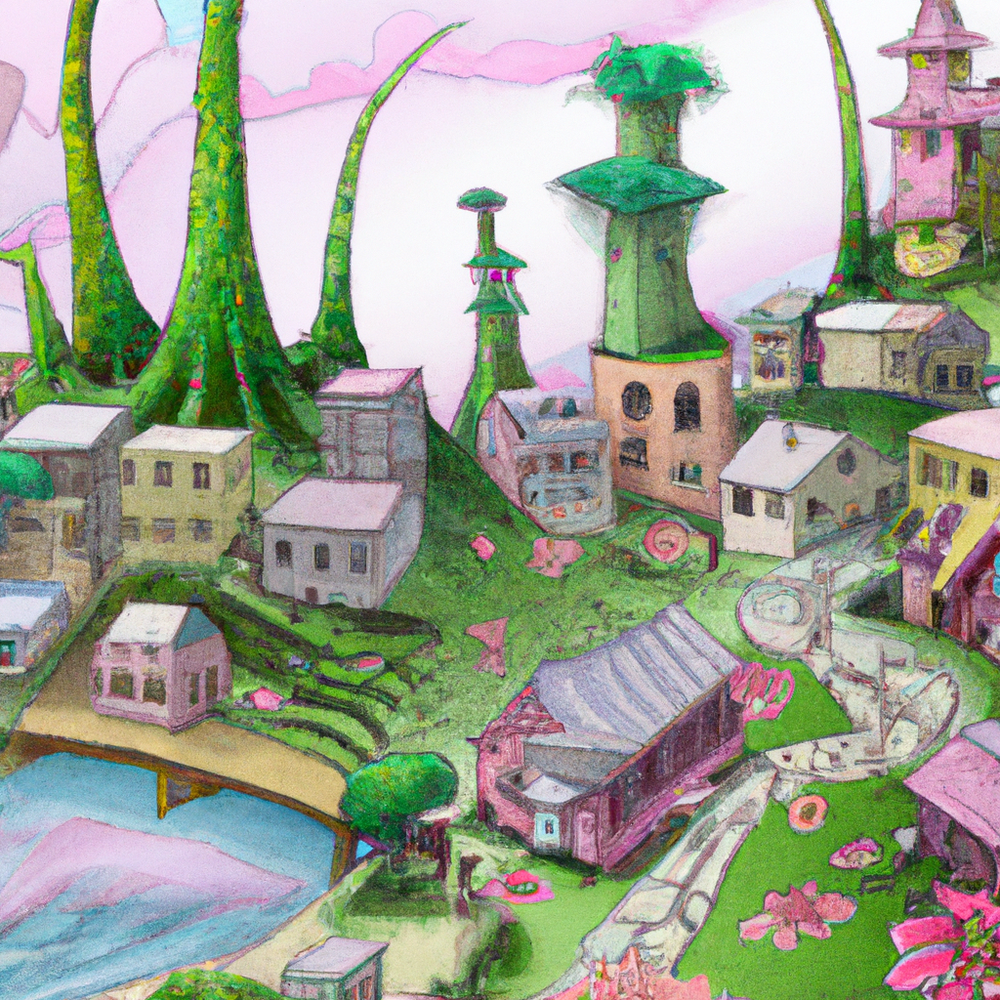
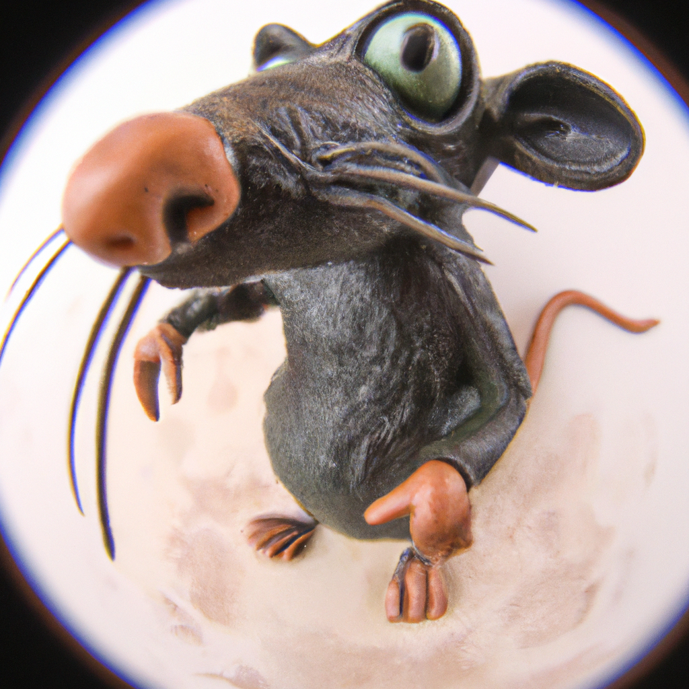
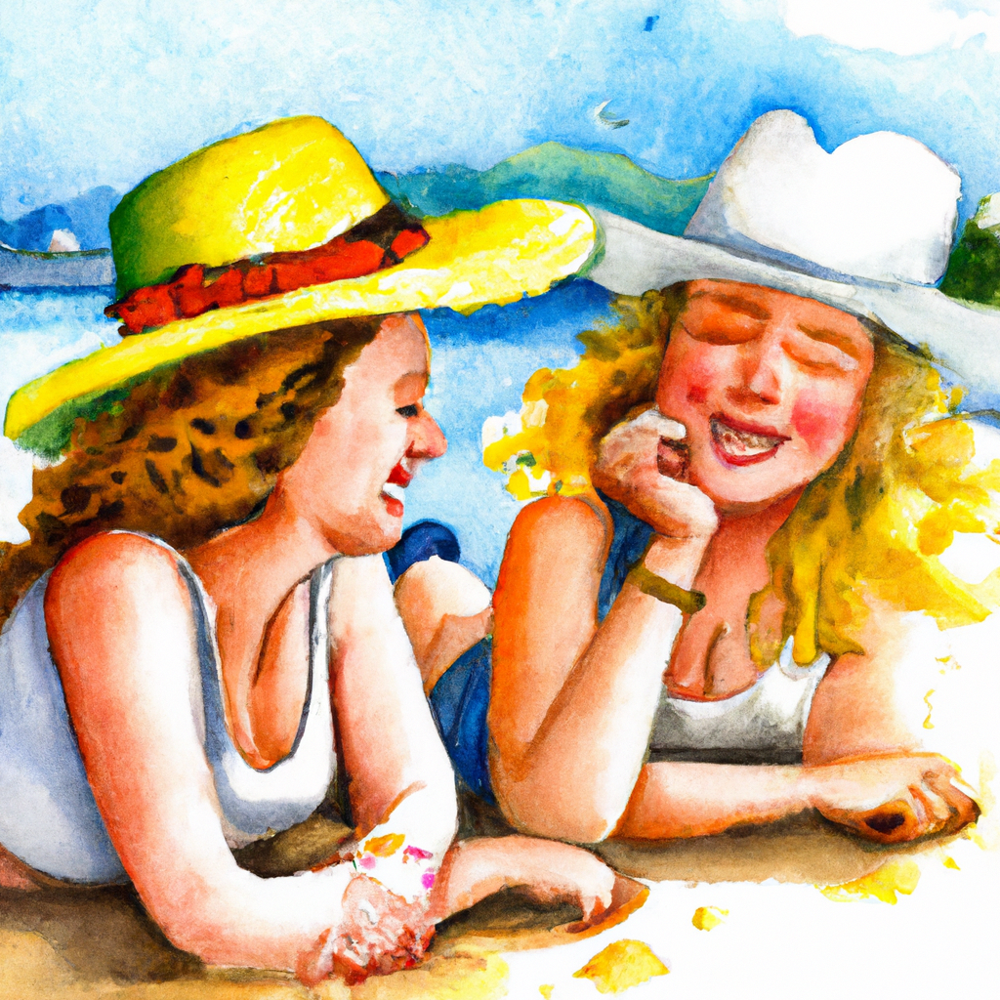
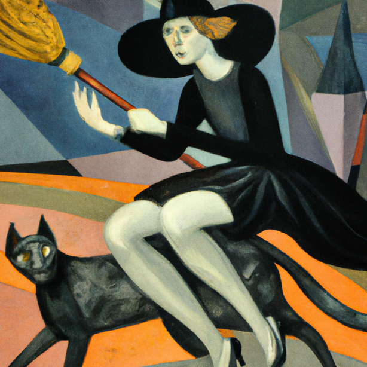
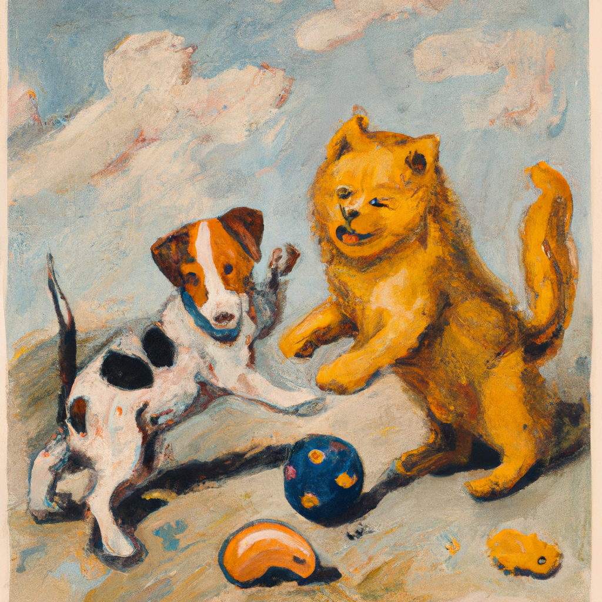
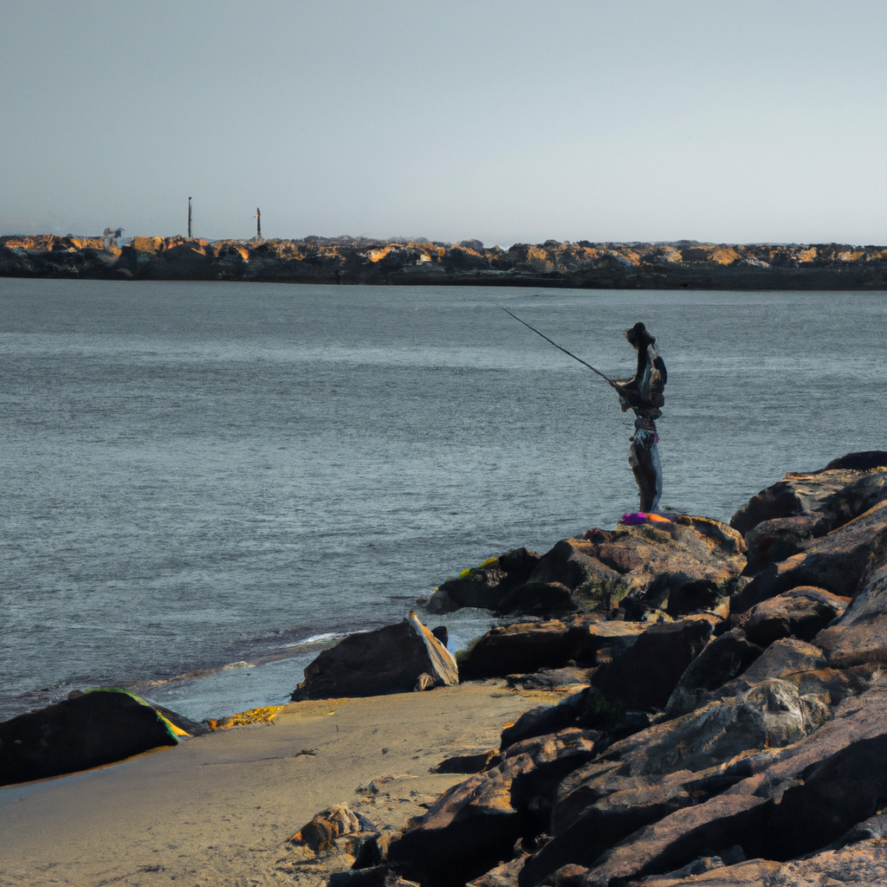
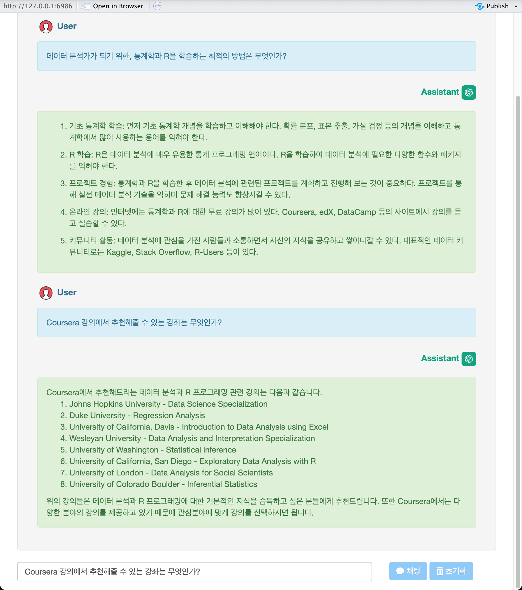
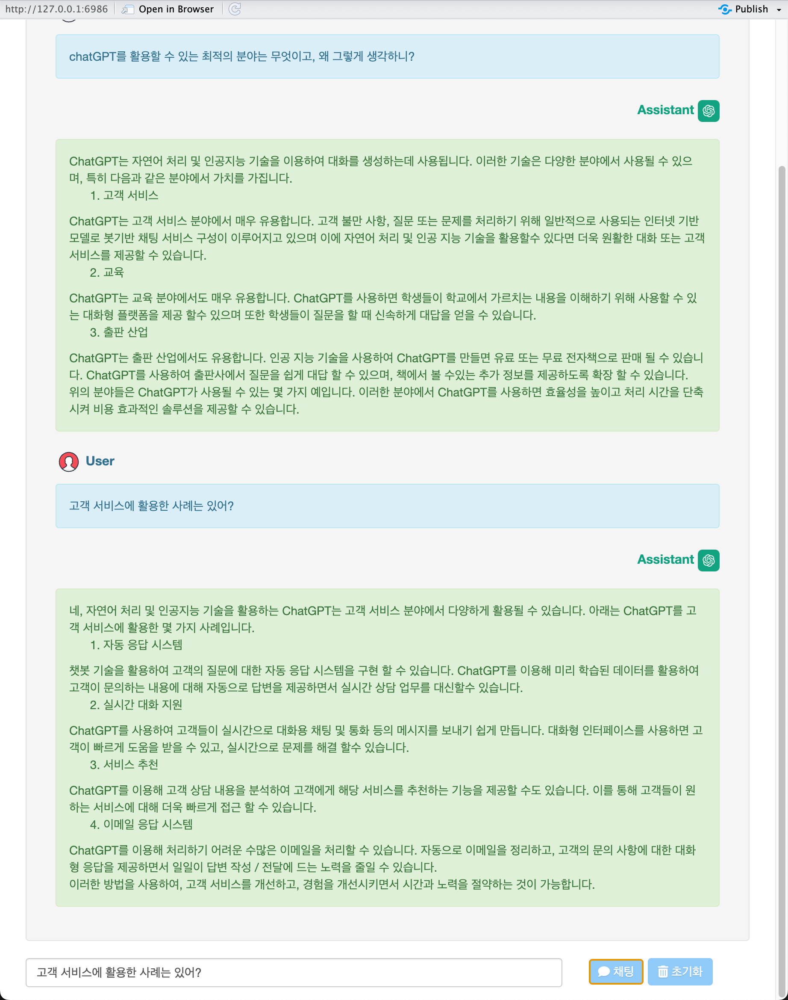
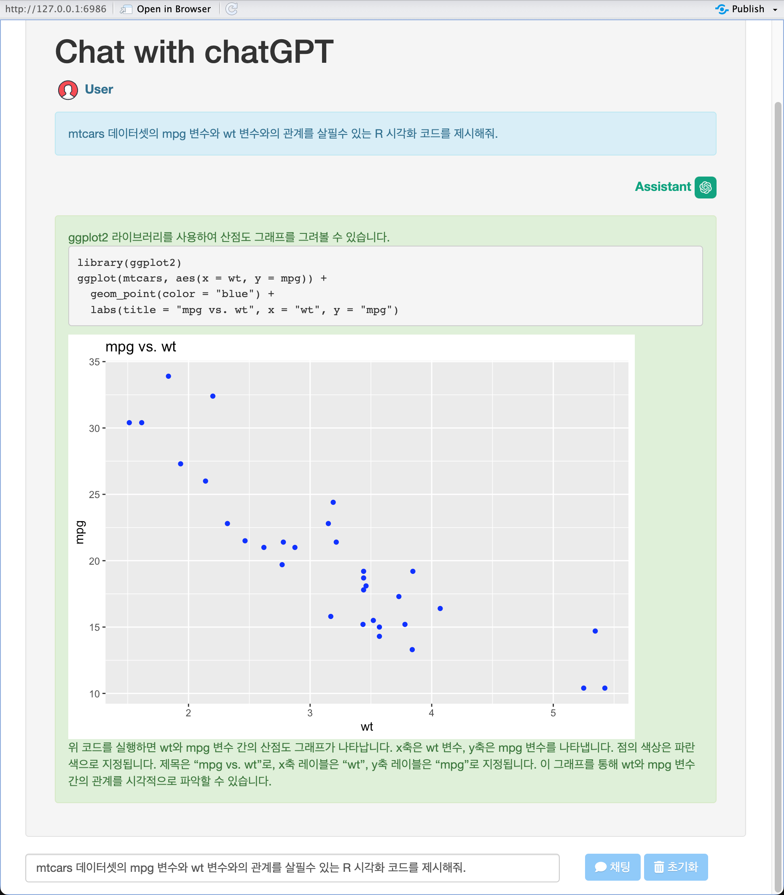
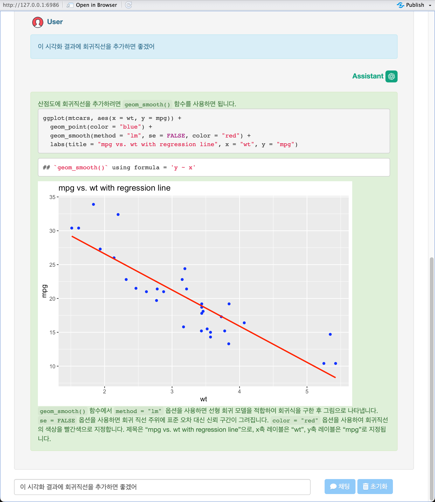

```{r, include = FALSE}
knitr::opts_chunk$set(
  collapse = TRUE,
  comment = "#>"
)
```

```{r setup, include=FALSE}
knitr::opts_chunk$set(echo = TRUE)
```

## 배경

shinyGPT 사용시 프롬프트를 입력하는 방법에 대해서 몇 가지 예제로 설명합니다.

## Create image

shinyGPT의 이미지 생성 프롬프트는 한글과 영문을 모두 지원합니다. 
한글을 입력할 경우에는 네이버 파파고 번역을 거쳐서 영문으로 질의하기 떄문에 걱정없이 한글을 사용해도 됩니다.

- 동일한 프롬프트라도 매번 동일한 그림을 그려주지 않습니다. 
    - 몇번의 시도로 마음에 드는 이미지를 얻었을 경우에는 다운로드 하세요.

### 영문

몇 가지 영문 프롬프트를 제세해 봅니다.

- "watercolor illustration of two kids who are best friends having a perfect summer day"
    - 프롬프트 출처: [r/dalle2 by Remarkable-Ad-1092](https://www.reddit.com/r/dalle2/comments/ualzft/watercolor_illustration_of_two_kids_who_are_best/){target="_blank"}

```{r image-6, echo=FALSE, out.width='65%', fig.align='center', fig.pos="!h", fig.cap="watercolor illustration of two kids who are best friends having a perfect summer day"}

```

<br>

- "city/garden of spirits painted by Hayao Miyazaki"
    - 프롬프트 출처: [r/dalle2 by L4ughline5](https://www.reddit.com/r/dalle2/comments/uqwc1j/citygarden_of_spirits_painted_by_hayao_miyazaki/){target="_blank"}
    
```{r image-7, echo=FALSE, out.width='65%', fig.align='center', fig.pos="!h", fig.cap="city/garden of spirits painted by Hayao Miyazaki"}

```

<br>

- "cubist painting of a young witch riding a broom with her black cat"
    - 프롬프트 출처: [Kitt × DALL·E](https://labs.openai.com/s/X6erB0d29ivb3TP8iTpud02B){target="_blank"}
    
```{r image-8, echo=FALSE, out.width='65%', fig.align='center', fig.pos="!h", fig.cap="cubist painting of a young witch riding a broom with her black cat"}

```

<br>

- "Claymation figure of a rat, photograph (fish eye lens)"
    - 프롬프트 출처: [Javier × DALL·E](https://labs.openai.com/s/17hpGrlgD26KPSHxfzGRWLyb){target="_blank"}

```{r image-9, echo=FALSE, out.width='65%', fig.align='center', fig.pos="!h", fig.cap="Claymation figure of a rat, photograph (fish eye lens)"}

```

<br>

### 한글

몇 가지 한글 프롬프트를 제시해 봅니다. 한글을 입력한 것을 내부에서 영문 프롬프트으로 번역 후 그림을 그립니다. 결과를 보면 한글과 영문의 결과에 차이가 없어 보입니다.

- "완벽한 여름날을 보내는 절친한 두 아이의 수채화 일러스트"
    - 번역: "watercolor illustration of two kids who are best friends having a perfect summer day"

```{r image-1, echo=FALSE, out.width='65%', fig.align='center', fig.pos="!h", fig.cap="완벽한 여름날을 보내는 절친한 두 아이의 수채화 일러스트"}

```

<br>

- "미야자키 하야오가 그린 영혼의 도시/정원"
    - 번역: "city/garden of spirits painted by Hayao Miyazaki"  

```{r image-2, echo=FALSE, out.width='65%', fig.align='center', fig.pos="!h", fig.cap="미야자키 하야오가 그린 영혼의 도시/정원"}

```

<br>

- "검은 고양이와 빗자루를 타고 있는 젊은 마녀의 입체파 그림"
    - 번역: "cubist painting of a young witch riding a broom with her black cat"     

```{r image-3, echo=FALSE, out.width='65%', fig.align='center', fig.pos="!h", fig.cap="검은 고양이와 빗자루를 타고 있는 젊은 마녀의 입체파 그림"}

```

<br>

- "르느와르가 그린 노란 고양이와 얼룩무니 개가 함께 하는 공놀이"    

```{r image-4, echo=FALSE, out.width='65%', fig.align='center', fig.pos="!h", fig.cap="르느와르가 그린 노란 고양이와 얼룩무니 개가 함께 하는 공놀이"}

```

<br>

- "강과 바다가 만나는 지점에서 낚시를 하는 젊은 청년" 

```{r image-5, echo=FALSE, out.width='65%', fig.align='center', fig.pos="!h", fig.cap="강과 바다가 만나는 지점에서 낚시를 하는 젊은 청년"}

```

<br>

### 이미지 변형

앱의 `변형` 버튼은 출력된 이미지를 비슷한 패턴으로 변형(image variation)시키는 기능을 수행합니다.

다음 그림은 앞에서 "미야자키 하야오가 그린 영혼의 도시/정원"의 영문 프롬프트로 그린 이미지를 2단계로 변형시킨 이미지입니다.

왼쪽이 원본 그림을 변형한 것이고, 오른쪽이 왼쪽 이미지를 변현한 것입니다.

```{r, echo=FALSE, eval=TRUE}
htmltools::p(align = "middle",
  htmltools::img(src = "img/city_garden_variation_01.png", width = "45%"),
  htmltools::img(src = "img/city_garden_variation_02.png",  width = "45%")
)
```

<br>

## 채팅 프롬프트

채팅 프롬프트는 한글과 영문 모두 가능하지만, 한글 프롬프트를 몇개 예를 듭니다.

- 채팅의 경우에는 이전의 질문을 고려하므로 추가질문이 가능합니다.
- 채팅이 길어지거나, 주제가 변경되었을 경우에는 `초기화` 버튼을 눌러서 다시 대화를 진행하면 유용합니다.

### 프롬프트 예제

- "데이터 분석가가 되기 위한, 통계학과 R을 학습하는 최적의 방법은 무엇인가?"
- "chatGPT를 활용할 수 있는 최적의 분야는 무엇이고, 왜 그렇게 생각하니?"
- "mtcars 데이터셋의 mpg 변수와 wt 변수와의 관계를 살필수 있는 R 시각화 코드를 제시해줘."

### 데이터 분석 학습 관련 질의

- "데이터 분석가가 되기 위한, 통계학과 R을 학습하는 최적의 방법은 무엇인가?"

```{r chat-1, echo=FALSE, out.width='85%', fig.align='center', fig.pos="!h", fig.cap="데이터 분석가가 되기 위한, 통계학과 R을 학습하는 최적의 방법은 무엇인가?"}

```

<br>

결과에 대해서 재질문한 사례입니다. 
"Coursera 강의에서 추천해줄 수 있는 강좌는 무엇인가?"라고 추가 추가 질문을 했습니다.

<br>

### chatGPT를 활용 관련 질의

- "chatGPT를 활용할 수 있는 최적의 분야는 무엇이고, 왜 그렇게 생각하니?"

```{r chat-2, echo=FALSE, out.width='85%', fig.align='center', fig.pos="!h", fig.cap="chatGPT를 활용할 수 있는 최적의 분야는 무엇이고, 왜 그렇게 생각하니?"}

```

<br>

이번 예제에서도 추가 질문을 수행해 보았습니다.


<br>

### R 시각화 관련 질의

- "mtcars 데이터셋의 mpg 변수와 wt 변수와의 관계를 살필수 있는 R 시각화 코드를 제시해줘."

```{r chat-3, echo=FALSE, out.width='85%', fig.align='center', fig.pos="!h", fig.cap="R 시각화 관련 질의"}

```

결과를 보면 mpg 변수와 wt 변수의 산점도를 그려주는 코드를 제시했습니다. 
그런데 이 시각화 결과에 회귀직선을 추가하고 싶어서 다음과 같이 추가 질의를 했습니다.

- "이 시각화 결과에 회귀직선을 추가했으면 좋겠어."

<br>

```{r chat-4, echo=FALSE, out.width='85%', fig.align='center', fig.pos="!h", fig.cap="R 시각화 관련 추가 질의"}

```

<br>

원하는 결과가 출력되었습니다.


